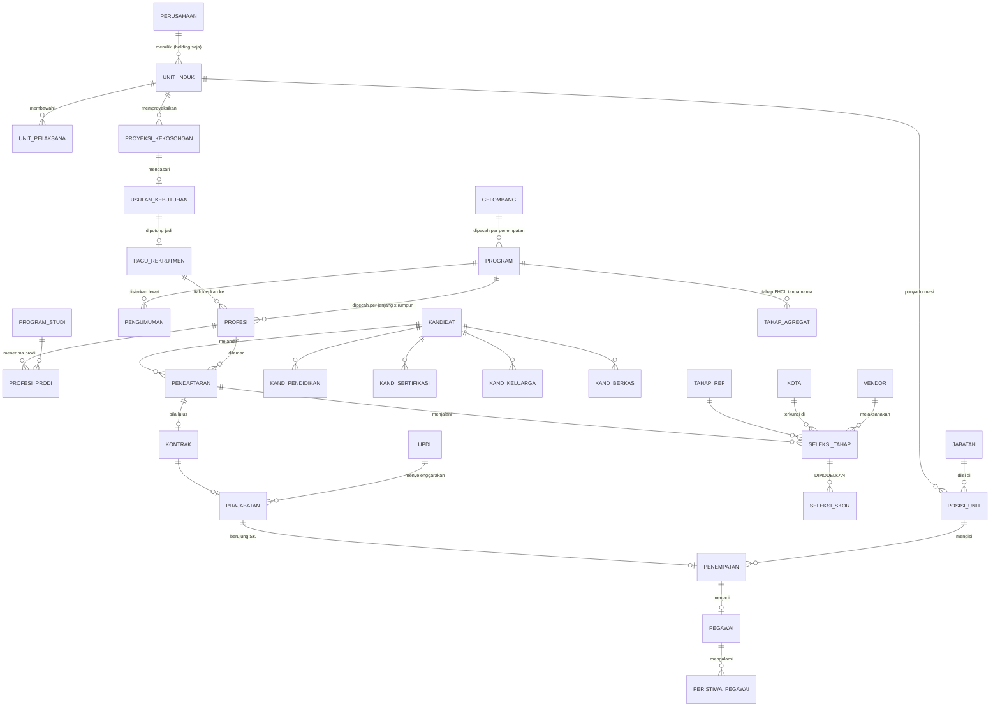

# ERD — database mock rekrutmen PLN Group

Model data untuk `out/rekrutmen.duckdb`. Direvisi total dari ERD mock lama setelah riset
R1–R7 (49 temuan). Kamus kolom lengkap ada di [kamus_data.md](kamus_data.md).

**Horison gelombang: 2019–2025. Tanggal potong: 15 September 2026.**
Semua status dihitung relatif ke tanggal potong.

---

## Perubahan besar dari ERD mock lama

| Hal | ERD lama | ERD baru | Sebab |
|---|---|---|---|
| Program | 1 level | **3 level**: gelombang → program (entri penempatan) → **profesi** | F-003, F-010 |
| Unit pendaftaran | program | **profesi** — tanggal, kota, IPK min semuanya melekat di sini | F-010 |
| Alamat kandidat | 1 alamat | **2 blok**: domisili & asal | F-034 |
| Blok fisik | tidak ada | **ada**: tinggi, berat, BMI, visus ki/ka, silinder, lingkar perut, tato | F-034 |
| Pendidikan | pendidikan tinggi saja | **wajib SD/SMP/SMA/SMK juga** → ±4 baris/kandidat | F-034 |
| Tahapan | tanggal & hasil | **+ `mode`, `kota`, `pemilik_proses`, `sistem_sumber`, `hadir`** | F-024, F-018, F-020 |
| Jalur | satu | **dua** (`mandiri` / `rbb`) sebagai atribut, bukan tabel terpisah | F-041, F-046 |
| Skor tes | dianggap ada | **ditandai `DIMODELKAN`** — sistem asli hanya simpan lulus/gagal | F-017 |
| Kuota per posisi | dianggap ada | **ditandai `DIMODELKAN`** — domain HST, tidak ada di manapun | F-017, F-027, F-043 |
| Nomor tes | segmen `ES` dibuang | **`ES` dipakai** — ternyata kode subholding penempatan | F-009 |
| Cakupan | holding | **PLN Group** (holding kaya, subholding ringkas) | DECISION-01 |

---

## Peta besar



---

## Tabel per area

### A. Master & referensi *(sebagian sudah jadi di `out/master/`)*

| Tabel | Baris | Status | Sumber |
|---|---:|---|---|
| `perusahaan` | 9 | baru | 1 holding + 8 subholding (DECISION-01, F-002, F-043) |
| `unit_induk` | 48 | ✅ ada | DAPEG + sheet FTK |
| `realisasi_bulanan` | 665 | ✅ ada | 13 titik bulanan per unit — ⚠️ lihat F-053 sebelum menjumlah |
| `unit_pelaksana` | 357 | ✅ ada | DAPEG |
| `jabatan` | 6.148 | ✅ ada | `jabatan_klasifikasi.csv` |
| `posisi_unit` | 11.781 / 20.271 | ✅ ada | `posisi_unit_induk` / `_pelaksana` |
| `program_studi` | 49 | baru | F-004 — prodi asli, jangan dikarang |
| `kota` | 43 | baru | F-019, nama dari F-031/F-032/F-006 |
| `updl` | 11 | baru | `unit_pelaksana.csv` |
| `vendor` | ±10 | baru | nama real: Prodia, Kimia Farma, LPT UI, UPAC PLN |
| `tahap_ref` | 16 | baru | `rules/tahapan.yaml` — 6 seleksi + 3 FHCI + 7 pasca |

> **Subholding sengaja ringkas** — hanya nama + bidang + jumlah, tanpa struktur unit
> internal, karena DAPEG tidak mencakup mereka. Holding tetap kaya sampai level posisi.

### B. Perencanaan kebutuhan — ⚠️ **seluruhnya `DIMODELKAN`**

| Tabel | Isi |
|---|---|
| `proyeksi_kekosongan` | pensiun + APS + tugas karya + mutasi per unit × posisi × tahun |
| `usulan_kebutuhan` | usulan unit (kekosongan + gap FTK) |
| `pagu_rekrutmen` | pagu yang disetujui pusat (± 62% dari usulan) |

Tidak ada satu pun angka kebutuhan/kuota di sumber manapun — F-017 (domain HST, bukan
HTD), F-027 (brosur tidak memuat kuota), F-043 (`total_job_available` RBB terbukti bukan
kuota). **Gap inilah insight utama dashboard**, bukan kekurangan yang perlu disembunyikan.
Satu-satunya bahan nyata: kolom FTK & realisasi di `unit_induk`.

> **2026 hidup di sini, bukan di area seleksi.** Tidak ada gelombang rekrutmen 2026
> (katalog asli berhenti Okt-2025), jadi tahun berjalan diisi **fase perencanaan**:
> proyeksi kekosongan → usulan unit → pagu. Bahannya nyata — gap antara `ftk_2025` (37.854)
> dan `realisasi_mar_2026` (37.153) di `unit_induk.csv`. Yang dimodelkan hanya penerjemahan gap itu
> jadi usulan & pagu per posisi. Ini justru lebih pas dengan ReqGathering#1 (kebutuhan
> rekrutmen sebagai fungsi pensiun/APS/mutasi) daripada gelombang karangan.

### C. Program rekrutmen — 3 level

| Tabel | Isi | Catatan |
|---|---|---|
| `gelombang` | angkatan, tahun, jalur, jenis program | nomor angkatan **seri paralel asli** (F-008) |
| `program` | 1 entri per penempatan/kota, judul asli | F-003 — 1 gelombang → 6–8 entri |
| `profesi` | **unit granular pendaftaran** | tgl buka/tutup, kota, kode, min IPK per prodi (F-010) |
| `profesi_prodi` | jembatan profesi ↔ program studi | + `ipk_min` per prodi |
| `pengumuman` | kanal penyiaran per program | Website, Job Fair, Iklan, Career Website, Socmed (F-029) |

Judul program **wajib** diambil dari `programs.csv` (31) + `programs_historis.csv` (111)
+ `lowongan_pln_rbb.csv` (20). **Tidak ada judul yang boleh dikarang.** Gelombang 2019
seluruhnya dari arsip Wayback; gelombang 2021 & 2024 tidak punya judul sama sekali dan
diberi penanda eksplisit *"(tidak terekam di katalog PLN)"*.

⭐ **Lubang nomor angkatan disengaja.** Deret aslinya melompat 74 → 78 → 81 → 86 → 91, dan
9 nomor di rentang itu (76, 77, 79, 80, 83, 84, 85, 89, 90) sengaja **tidak diberi
gelombang**. Lompatan itu bukti katalog publik tidak lengkap — F-021 mencatat sistem HTD
memuat **222 rekrutmen** sementara publik hanya menampilkan **31**. Mengisinya dengan nomor
karangan akan menghapus bukti itu. Kolom `sumber_nomor` (`nyata` / `inferensi_kuat` /
`inferensi`) memisahkan 8 nomor yang tercatat di sumber dari yang diperkirakan.

### D. Kandidat — akun *lifetime*

| Tabel | Perkiraan baris | Catatan |
|---|---:|---|
| `kandidat` | ±498.800 | 233rb pernah melamar + 266rb akun tanpa lamaran (F-019) |
| `kandidat_pendidikan` | ±1.145.000 | ±4 baris/pelamar — SD/SMP/SMA **wajib** (F-034) |
| `kandidat_sertifikasi` | ±108.000 | 31% pelamar punya; **satu-satunya skor yang nyata ada** |
| `kandidat_keluarga` | ±350.000 | 1–2 baris/pelamar |
| `kandidat_berkas` | ±1.865.000 | 8 jenis berkas × pelamar |

`kandidat` memuat **dua blok alamat** (domisili & asal) dan **blok fisik**
(tinggi, berat, BMI, visus kiri/kanan, silinder, lingkar perut, tato, ukuran baju/celana/
sepatu). Blok fisik **kosong di kohort lama** sesuai `rules/kelengkapan.yaml` — jangan
diisi mundur.

### E. Pendaftaran & seleksi

| Tabel | Perkiraan baris | Catatan |
|---|---:|---|
| `pendaftaran` | ±314.730 | 1 akun bisa punya banyak (rata-rata 1,35) |
| `seleksi_tahap` | ±620.600 | 1 baris per (pendaftaran × tahap yang dijalani) |
| `seleksi_skor` | ±640.000 | komponen skor — ⚠️ **`DIMODELKAN` seluruhnya** |
| `tahap_agregat` | ±27 | tahap FHCI: **tanggal + jumlah, tanpa `kandidat_id`** |

**Satu tabel `seleksi_tahap` untuk kedua jalur.** Jalur adalah kolom
(`sumber_rekrutmen`), bukan struktur terpisah. Kandidat RBB cukup **tidak punya baris**
untuk `administrasi` dan `adaptif` — titik masuknya `akademik_inggris` (varian TKB saja,
tanpa komponen Inggris karena sudah dikerjakan FHCI).

`tahap_agregat` sengaja tidak punya foreign key ke kandidat: **data itu memang tidak ada
di PLN.** Itu fakta yang ditampilkan, bukan keterbatasan yang ditutupi.

### F. Pasca-seleksi & penempatan

| Tabel | Perkiraan baris | Pemilik proses |
|---|---:|---|
| `kontrak` | ±8.497 | HTD |
| `prajabatan` | ±8.429 | **Pusdiklat** (aplikasi terpisah) |
| `penempatan` | ±6.427 | HTD (SK Pengangkatan) |
| `pegawai` | ±6.427 | hasil akhir, tersambung ke `posisi_unit` |

Perpindahan kepemilikan HTD → Pusdiklat → HTD (F-018) membuat data terpecah dua aplikasi.
Tandai lewat `sistem_sumber` supaya titik rawan integrasi ini terlihat di dashboard.

> ⭐ **"Diterima" ≠ "sudah jadi pegawai".** Perhatikan `penempatan` (6.427) jauh lebih
> kecil dari `kontrak` (8.497): selisih **1.905 orang** adalah kohort 2025 (angkatan 91 & 92)
> yang **sedang OJT** pada tanggal potong — sudah ttd kontrak Maret 2026, SK-nya baru
> 9 November 2026. Ini bukan kebocoran data, melainkan pipeline yang memang berjalan,
> dan salah satu tampilan paling berguna: *berapa orang sedang OJT sekarang, kapan
> mereka ber-SK.*
>
> Semuanya turun dari tanggal asli (gelombang tutup 5 Okt 2025) + durasi tahapan —
> **tanpa satu pun gelombang karangan.**

### G. Kepegawaian & attrition

| Tabel | Isi |
|---|---|
| `headcount_tahunan` | runtun **2016–2025** Group/Induk/Anak (F-044, F-048), + penanda turunan |
| `peristiwa_pegawai` | pensiun, APS, meninggal, PHK, mutasi, tugas karya, **carve-out** |

⚠️ **Dua metrik turnover, bukan satu.** SR-2017 & SR-2020 memakai definisi **sempit**
(hanya APS + PHK; pensiun dilaporkan terpisah → 0,2%), sedangkan SR-2021 ke atas memakai
definisi **luas** (termasuk pensiun → 2,7%). Menderetkannya apa adanya memunculkan lompatan
palsu 0,2% → 2,7% di 2021 yang terbaca sebagai krisis retensi. Simpan `turnover_sempit`
dan `turnover_luas` terpisah, dan beri penanda patahan definisi (F-049).

`jenis_perubahan_headcount` **wajib** memisahkan `CARVE_OUT` dari `ATTRITION`. Penurunan
2022→2023 (−3.609) adalah pemindahan ke subholding, bukan orang keluar (F-045). Kalau
digabung, laju attrition 2023 terbaca ±9,5% — 3,5× angka sebenarnya.

---

## Kolom yang wajib ada di hampir semua tabel fakta

| Kolom | Guna |
|---|---|
| `sumber_sistem` | `rekrutmen.pln.co.id` / `seleksi.pln.co.id` / `aplikasi Pusdiklat` / `FHCI` / `DIMODELKAN` |
| `sumber_rekrutmen` | `mandiri` / `rbb` |
| `kualitas_kohort` | `RENDAH` / `SEDANG` / `BAIK` / `BERJALAN` — dari `rules/kelengkapan.yaml` |
| `tahun_program` | kunci waktu utama (bukan tahun prajabatan — beda, ada jeda) |

Empat kolom ini yang memungkinkan dashboard menjawab pertanyaan inti proyek:
**"mana yang sudah kita punya, dan mana yang masih perlu ditambahkan?"**

---

## Dua jalur, satu kosakata

```
JALUR MANDIRI  [PLN] administrasi → adaptif → akademik+inggris → psikologi
                     → fisik/MCU → wawancara
                     ↑ per-kandidat sejak tahap pertama

JALUR RBB      [FHCI] adm → TKD/AKHLAK/TWK → inggris/Learning Agility
                     ↑ tabel `tahap_agregat`: tanggal + jumlah, TANPA nama
               [PLN] akademik (TKB saja) → psikologi → fisik/MCU → wawancara
                     ↑ serah-terima: masuk `seleksi_tahap` yang SAMA

KEDUANYA       ttd kontrak → SAMAPTA → pembidangan → OJT → ujian OJT → SK penempatan
```

Satu-satunya perbedaan struktural = **titik masuk**. Semua aturan, kosakata tahapan, dan
tabel identik. Yang berbeda hanya laju (kandidat RBB sudah tersaring FHCI, jadi kehadiran
dan kelulusannya lebih tinggi) dan kelengkapan data (jejaknya di PLN lebih sedikit).

⚠️ Keyakinan pemodelan RBB **sedang** — sumbernya pemberitaan, bukan dokumen resmi PLN.
Tiga pertanyaan terbuka untuk tim HTD tercatat di F-046 dan `rules/tahapan.yaml`.
